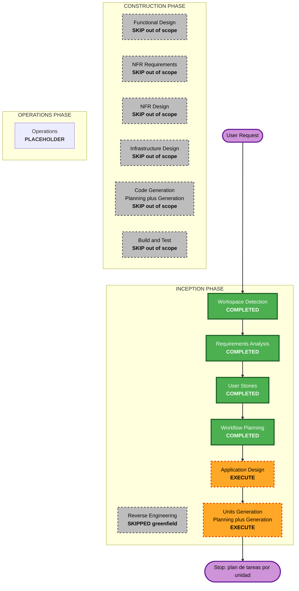

# Execution Plan — Agentic QA Swarm

## Detailed Analysis Summary

### Change Impact Assessment
- **User-facing changes**: Yes — plataforma y UI completamente nuevas (inbox, sandbox, reportes, paneles de política M7/M8).
- **Structural changes**: Yes — sistema nuevo system-wide (control plane estable + namespace de prueba efímero por corrida).
- **Data model changes**: Yes — modelos nuevos (notificaciones, sesiones/planes, reportes/evidencia, políticas, auditoría).
- **API changes**: Yes — API del control plane nueva (UI/API Gateway, GitHub webhooks, Slack).
- **NFR impact**: Yes — SECURITY-01..15 bloqueantes, RESILIENCY-01..15 direccionales, PBT parcial, KPIs (teardown 100%, ensayo >70%).

### Risk Assessment
- **Risk Level**: High — plataforma system-wide nueva con componentes de IA (inferencia de superficie, post-mortem) e infraestructura efímera con requisitos de aislamiento verificable; incertidumbre principal en comportamiento del LLM y escape de namespace (riesgo #1 del PRD).
- **Rollback Complexity**: N/A (greenfield — nada desplegado que revertir; el trabajo actual no toca infraestructura por AUTONOMIA-01).
- **Testing Complexity**: Complex — sandbox efímero, gates (confirm/ensayo), dataset de evaluación con bugs sembrados, red-teaming (7 escenarios PRD §11).

## Workflow Visualization

### Text Alternative
- INCEPTION: Workspace Detection COMPLETED → Reverse Engineering SKIPPED (greenfield) → Requirements Analysis COMPLETED → User Stories COMPLETED → Workflow Planning COMPLETED → Application Design EXECUTE → Units Generation EXECUTE → Stop (plan de tareas por unidad).
- CONSTRUCTION: Functional Design, NFR Requirements, NFR Design, Infrastructure Design, Code Generation, Build and Test — SKIP (fuera del alcance declarado: sin código).
- OPERATIONS: PLACEHOLDER.

## Phases to Execute

### 🔵 INCEPTION PHASE
- [x] Workspace Detection (COMPLETED)
- [x] Reverse Engineering (SKIPPED — greenfield, sin código existente)
- [x] Requirements Analysis (COMPLETED — requirements.md aprobado por directiva)
- [x] User Stories (COMPLETED — 13 historias + 3 personas aprobadas)
- [x] Workflow Planning (COMPLETED — este documento)
- [ ] Application Design - EXECUTE
  - **Rationale**: 8 módulos nuevos (M1-M8) requieren identificación de componentes, métodos, servicios y dependencias antes de descomponer en unidades.
- [ ] Units Generation - EXECUTE
  - **Rationale**: el sistema requiere descomposición en unidades de trabajo; el punto de parada declarado del trabajo es el plan de tareas de cada unidad (unit-of-work.md + dependencias + story-map + planes de tareas con criterios verificables por comando según AUTONOMIA-02).

### 🟢 CONSTRUCTION PHASE
- [ ] Functional Design - SKIP
  - **Rationale**: fuera del alcance declarado (el trabajo se detiene al terminar el plan de tareas de cada unidad; sin diseño detallado de lógica de negocio).
- [ ] NFR Requirements - SKIP
  - **Rationale**: fuera del alcance declarado (stack ya decidido a nivel de requisitos: Go + capa agentes, MinIO, Flux, GitHub Actions).
- [ ] NFR Design - SKIP
  - **Rationale**: fuera del alcance declarado.
- [ ] Infrastructure Design - SKIP
  - **Rationale**: fuera del alcance declarado (topología y GitOps ya decididos a nivel de requisitos).
- [ ] Code Generation - SKIP
  - **Rationale**: fuera del alcance declarado — "No escribas código" (directiva explícita del usuario).
- [ ] Build and Test - SKIP
  - **Rationale**: fuera del alcance declarado (sin código que compilar/probar).

### 🟡 OPERATIONS PHASE
- [ ] Operations - PLACEHOLDER
  - **Rationale**: workflows futuros de despliegue y monitoreo (el despliegue GitOps del Módulo 8 queda especificado, no ejecutado).

## Estimated Timeline
- **Total Phases**: 2 etapas restantes de INCEPTION (Application Design, Units Generation)
- **Estimated Duration**: 2 interacciones con compuertas (diseño + unidades), cada una con preguntas y aprobación

## Success Criteria
- **Primary Goal**: especificar el producto y terminar el plan de tareas de cada unidad, sin escribir código
- **Key Deliverables**: application-design/* (components, methods, services, dependencies), unit-of-work.md, unit-of-work-dependency.md, unit-of-work-story-map.md, planes de tareas por unidad con criterios verificables
- **Quality Gates**: aprobación explícita en Application Design y en Units Generation (plan + artefactos)