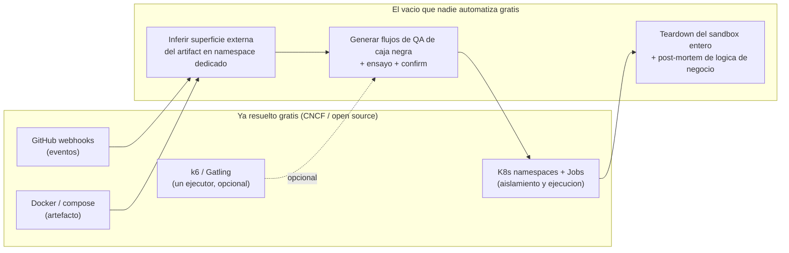
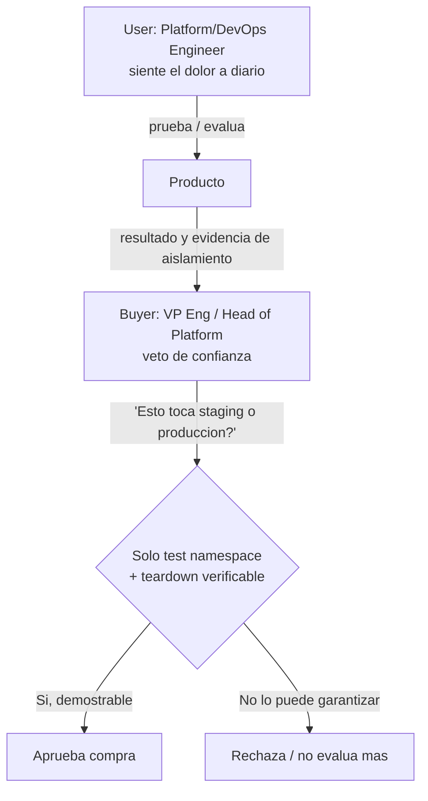
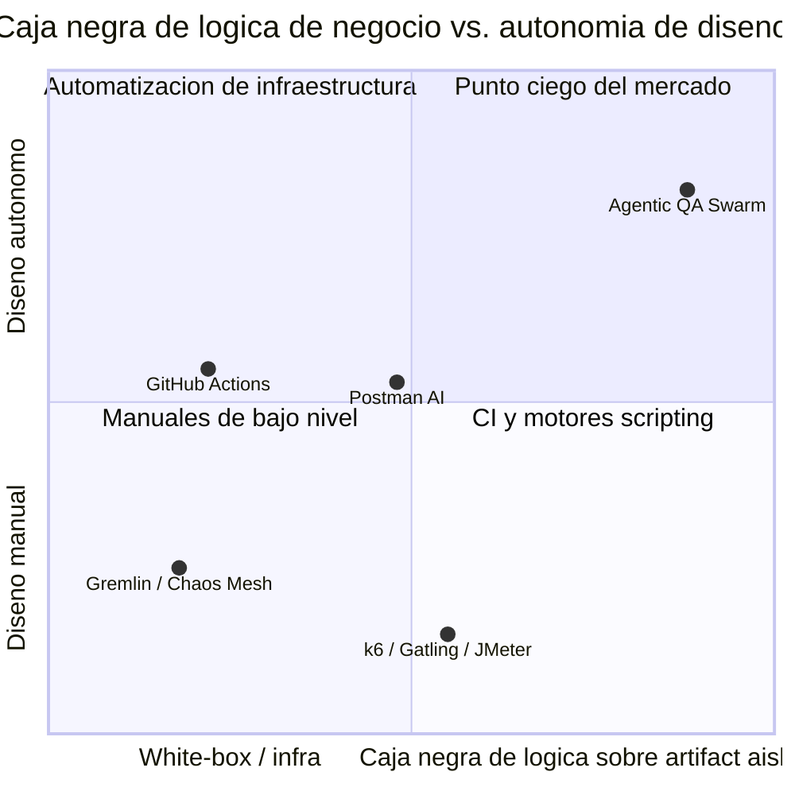
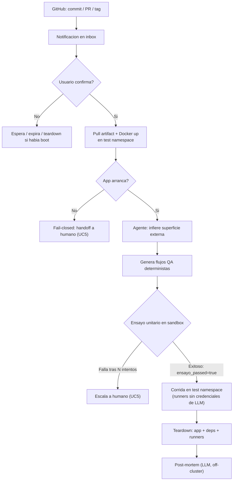
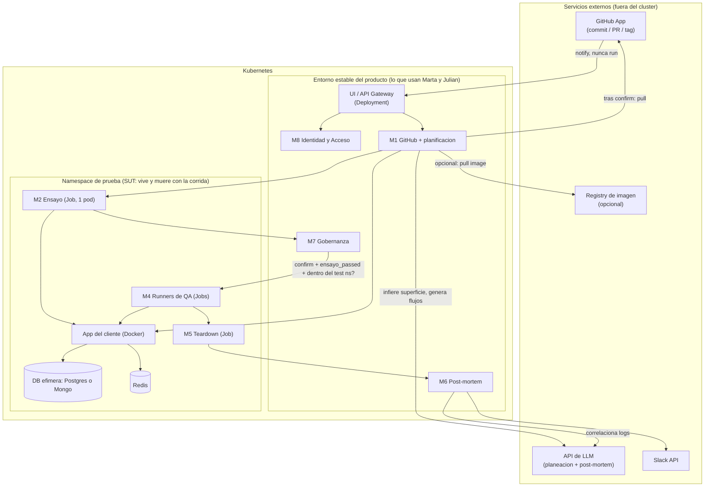
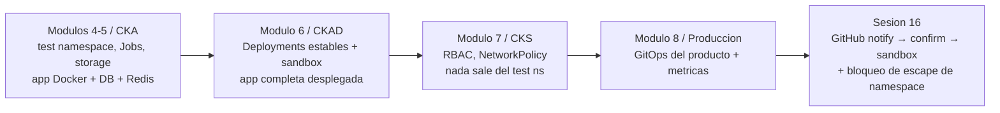

# PRD — Agentic QA Swarm

> Documento construido en co-creación iterativa. Cada afirmación de datos respeta las etiquetas `[INTERNO]` (proyección propia) y `[VERIFICAR]` (afirmación sin fuente confirmada de forma independiente). Ningún `[VERIFICAR]` se presenta como hecho.

**Documentos fuente (`docs/`):**

| Referencia usada | Archivo |
|---|---|
| Product Vision Board | `docs/pvd.md` |
| Panorama del dominio | `docs/overview.md` |
| Análisis de mercado | `docs/mercado.md` |
| Perfil de cliente ideal (ICP) | `docs/icp.md` |
| Investigación de crítica adversarial | `docs/critica.md` |
| Investigación de validación | `docs/validacion.md` |
| Mockup de UI | `docs/mockups/swarm-mock.html` |

---

## Paso 0 — Resolución de conflictos entre documentos

Antes de redactar el PRD se cruzaron los 6 documentos y se identificaron conflictos/vacíos. Decisiones tomadas:

| # | Conflicto | Resolución |
|---|---|---|
| 1 | Cifras de mercado sin fuente (~$24B en `mercado.md`; predicción de Gartner sin cita) | Se reemplazan por fuentes nombradas y verificables: **Global Market Insights** ("Automation Testing Market Size": $20B en 2022 → proyección >$40B para 2032) y **Gartner** (Mark O'Neill, Dionisio Zumerle, *"How to Build an Effective API Security Strategy"*, 2017/2019: *"Para 2022, los abusos de API pasarán de ser poco frecuentes a convertirse en el vector de ataque más frecuente..."*). La afirmación "OWASP confirma que se cumplió" queda `[VERIFICAR]`. Se deja constancia de que el $24B original de `mercado.md` no coincide exactamente con el $20B de la fuente nueva. |
| 2 | SOM definido como headcount (50-500 empleados, `icp.md`) vs. ronda de inversión (Series A-C, `mercado.md`) | No son excluyentes. El criterio real es cualitativo: empresas enfocadas en **crecer** más que en construir capacidades internas de testing. Se usa como señal de fit, no como filtro firmográfico duro. |
| 3 | Tensión entre `validacion.md` (optimista: "de semanas a minutos") y `critica.md` (riesgos que exigen arquitectura de seguridad no trivial) | El PRD se construye sobre el **escenario de fricción de `critica.md`** como caso base. "Minutos" queda como meta aspiracional, no como promesa del MVP. |
| 4 | El ICP carece de SRE dedicado, pero el artefacto necesita deps (DB, cache) para arrancar | El MVP **sí aprovisiona el entorno del SUT**: la app en Docker **y** sus deps (1 Postgres o Mongo + 1 Redis) **dentro del namespace de prueba**. No se usa staging del cliente. |
| 5 | Meta de "Time-to-first-isolated-run < 5 min" sin baseline numérico | Baseline se mantiene **cualitativo** ("semanas", `[VERIFICAR]`), sin inventar una cifra numérica de partida. |
| 6 | Geografía y madurez de Kubernetes del ICP no explícitas | Geografía: **LatAm y US**. Madurez de Kubernetes: inferida como intermedia-alta, marcada explícitamente como inferencia, no dato. El cluster es necesario para el **namespace de prueba**, no para atacar el staging del cliente. |
| 7 | Numeración OWASP API6 (Mass Assignment en 2019, SSRF en 2023) | El PRD evita anclar el argumento a un número de categoría fijo; usa el concepto "fallas de lógica de negocio" y aclara la edición cuando es relevante. |
| 8 | Distinción buyer (VP Eng/Head of Platform) vs. user (Platform/DevOps Engineer) | `icp.md` se usa como fuente autoritativa; es consistente con el "veto de confianza" que define `pvd.md`. |
| 9 | Auto-disparo en GitHub vs. confirmación humana | **Auto-notify sí, auto-run no.** Commit, PR y tag/release crean una notificación. La corrida solo arranca tras confirmación explícita. |

---

## 1. One-liner + Job to be Done

### One-liner

> **Agentic QA Swarm** convierte un evento de GitHub (commit, PR o tag/release) en una corrida de QA de caja negra contra una copia aislada de la app: el humano confirma, el sistema trae el artefacto, lo arranca en Docker dentro de un namespace de prueba, genera los flujos a partir de lo que la app expone hacia afuera, los ensaya, los ejecuta y entrega un post-mortem de lógica de negocio. Staging y producción del cliente no son el blanco.

### Job to be Done

**JTBD primario (usuario diario — Platform/DevOps Engineer):**

> Cuando llega un commit, un PR o un release y sé que un bug de lógica de negocio puede costarle dinero a la empresa, pero no tengo tiempo para escribir ni mantener flujos de QA —y no quiero apuntar herramientas a staging—, quiero confirmar la notificación, dejar que el sistema levante una copia aislada de mi app, genere los flujos como lo haría un QA y me explique qué invariante falló, para encontrar esas fallas antes de producción sin bloquear el trabajo de valor de mi equipo.

**JTBD secundario (comprador — VP of Engineering / Head of Platform):**

> Cuando necesito bajar el *Change Failure Rate* de mis releases transaccionales sin contratar un equipo de SRE/QA dedicado, quiero una herramienta que pruebe el artefacto de forma autónoma pero **verificablemente aislada de mi staging y de producción**, para mostrar reducción de incidentes sin asumir el riesgo de que la herramienta misma toque los entornos que usa gente.

### Misión del producto

> Eliminar el trabajo manual de diseñar, escribir y mantener QA de caja negra para apps transaccionales, cerrando el ciclo completo —evento GitHub → notify → confirm → artifact → Docker en namespace → inferir superficie → flujos QA → ensayo → run → teardown → post-mortem— dentro de límites de autonomía verificables, para que un equipo de 3 a 15 ingenieros obtenga cobertura de fallas de lógica de negocio que hoy solo un equipo de QA/SRE dedicado podría producir.

---

## 2. Contexto y problema

### 2.1 Dolores del mercado (con datos y fuente)

**Dolor macro (seguridad):**

> *"Para 2022, los abusos de API pasarán de ser poco frecuentes a convertirse en el vector de ataque más frecuente, resultando en brechas de datos para aplicaciones web empresariales."*
> — Gartner, *"How to Build an Effective API Security Strategy"* (Mark O'Neill, Dionisio Zumerle, 2017/2019).

La afirmación de que "hoy OWASP confirma que esta predicción se cumplió" queda `[VERIFICAR]` por no tener documento específico citado.

**Tamaño de mercado (contexto de categoría, no validación de demanda del producto):**

> *"El mercado global de Automation Testing superó los $20 mil millones de dólares en 2022 y se proyecta que alcance más de $40 mil millones para 2032, impulsado por la adopción de metodologías ágiles y DevOps."*
> — Global Market Insights, *Automation Testing Market Size*.

⚠️ `docs/mercado.md` original menciona *"~$24B USD"* para la misma categoría, sin fuente — cifra distinta a la anterior, consistente en orden de magnitud pero no idéntica.

**Dolor específico del ICP:**

* `icp.md`: *"Cada vez que lanzamos una feature transaccional, descubrimos bugs de lógica de negocio en producción que cuestan dinero. No puedo justificar 3 ingenieros de QA, y no voy a dejar que una herramienta pegue contra nuestro staging."* (buyer)
* `icp.md`: *"CI ya corre en cada PR, pero solo ejecuta lo que el repo ya trae (o apunta a staging). Mantener flujos de QA de caja negra a mano es tedioso y se rompe cuando cambia la superficie externa."* (user)
* `pvd.md`: *"Escribir y mantener flujos de QA (funcionales, de estado, de concurrencia) toma **semanas, no horas**. El 80% es plomería de autenticación, setup y teardown, no diseño de prueba."* `[VERIFICAR]`
* `validacion.md`: *"Los equipos de plataforma (3-15 ingenieros) suelen abandonar el mantenimiento de flujos complejos de QA/Chaos porque el tiempo de ingeniería no escala, y rechazan herramientas que usen su staging como blanco."* `[VERIFICAR]`
* Las fallas más caras (condiciones de carrera, invariantes de negocio, categoría de *Mass Assignment*/lógica de negocio de OWASP API Security Top 10) no las detectan SAST/DAST ni tests unitarios — solo flujos reales contra la app corriendo.

### 2.2 ¿Por qué ahora?

* `overview.md`: GitHub ya dispara CI en cada commit/PR/release, pero ese pipeline prueba **lo que el repo ya contiene** o apunta a **staging compartido**. El QA de caja negra contra una copia aislada del artefacto sigue siendo manual.
* `overview.md`: *"Los LLMs con razonamiento profundo pueden, por primera vez, observar una app en ejecución y comportarse como un QA: entender lo que es visible desde fuera (OpenAPI si existe, HTTP, UI expuesta) e inferir los flujos a ejercitar."* Este es el habilitador técnico real: sin razonamiento sobre la superficie externa, el producto no es viable.
* Convergencia de madurez: el ICP ya usa GitHub, Docker y (o puede usar) Kubernetes — la pieza que faltaba era la capa de razonamiento más el sandbox, no el webhook.

### 2.3 Alternativas actuales del ICP (y por qué no alcanzan)

| Alternativa | Qué resuelve hoy | Por qué no alcanza |
|---|---|---|
| **GitHub Actions / CI genérico** | Corre la suite del repo en cada evento | White-box o contra staging; no genera QA de caja negra ni post-mortem de lógica de negocio (`mercado.md`) |
| **k6 / Gatling / JMeter** (k6 es open source) | Motor de carga como código | Determinista; semanas de programación manual; no arranca el artefacto (`mercado.md`) |
| **Gremlin / Chaos Mesh** (Chaos Mesh es CNCF) | Chaos de infraestructura, Capa 4 | No ataca lógica de negocio en Capa 7 (`mercado.md`, `validacion.md`) `[VERIFICAR: roadmaps L7]` |
| **Postman (IA)** | Aserciones de un endpoint aislado | No levanta el artefacto ni cubre el trabajo de un QA `[VERIFICAR]` |
| **Escáneres SAST/DAST** | Vulnerabilidades sintácticas | No detectan problemas de estado (`pvd.md`) |
| **Nada** (statu quo más común) | — | El equipo abandona el mantenimiento y asume el riesgo en producción (`validacion.md`) `[VERIFICAR]` |

### 2.4 Qué ya está resuelto gratis por open source / CNCF

* **Disparo de eventos: resuelto gratis.** GitHub webhooks.
* **Correr el artefacto: resuelto gratis.** Docker / compose.
* **Aislamiento y Jobs: resuelto gratis.** Namespaces de Kubernetes + `Jobs` nativos.
* **Motor de carga (opcional): resuelto gratis.** k6 es open source. *"No competimos: podemos orquestarlos como un ejecutor"* (`pvd.md` sec. 4).
* **Caos de infraestructura: resuelto gratis.** Chaos Mesh (CNCF).

**Lo que no está resuelto gratis:** inferir la superficie externa de un artefacto recién levantado, generar el trabajo de un QA (no solo un ataque), el bucle de gobernanza (notify ≠ run, ensayo obligatorio, teardown del **sandbox entero**), y el post-mortem correlacionado con causa de negocio.

**Consecuencia honesta:** un ingeniero suficientemente disponible puede lograr el mismo resultado técnico gratis a mano. El producto vende de vuelta el tiempo de ingeniería y la disciplina de gobernanza — no una capacidad inexistente en el mercado.

---

## 3. ICP detallado

### 3.1 Firmographics

| Dimensión | Valor | Fuente |
|---|---|---|
| **Tamaño de empresa** | Scale-ups y medianas empresas tecnológicas, 50-500 empleados | `icp.md` |
| **Tamaño de equipo comprador** | 3 a 15 ingenieros | `icp.md`, `pvd.md` |
| **Verticales** | E-commerce, Fintech, Logística, SaaS B2B transaccional | `icp.md`, `pvd.md` |
| **Geografía** | LatAm, US | Decisión Paso 0 (#6) |
| **Stack técnico** | GitHub; artefacto Docker-runnable; K8s para el namespace de prueba; HTTP/UI al arrancar (OpenAPI es ventaja, no gate) | `icp.md` |
| **Madurez en Kubernetes** | Inferida como intermedia-alta | Inferencia — `TBD` a validar con clientes piloto |
| **Señal de fit adicional** | Foco en crecer, no en construir capacidades internas de testing/SRE; rechazo a herramientas que usen staging como blanco | Decisión Paso 0 (#2), `icp.md` |
| **Anti-perfil** | No puede correr la app en Docker; sin GitHub; QA de caja negra aislado ya maduro y staffed | `pvd.md` |

> ⚠️ La madurez de Kubernetes es una inferencia, no un dato de tus documentos — validar en las primeras 5-10 entrevistas de descubrimiento. OpenAPI ausente **no** descalifica si la app expone HTTP/UI al arrancar.

### 3.2 Buyer personas y veto de confianza

| | Buyer (firma el cheque) | User (usa a diario) |
|---|---|---|
| **Rol** | VP of Engineering / Director of Platform Engineering | Platform Engineer, DevOps Engineer, Backend Lead |
| **Qué mide** | *Change Failure Rate*, presupuesto de SRE | Tiempo no perdido en mantenimiento de flujos de QA; no tocar staging |
| **Veto de confianza** | Sí | No |

> *"¿Esto toca nuestro staging o producción?"* — Si la respuesta no es *"no: solo el namespace de prueba; la app vive y muere con la corrida; teardown obligatorio"*, la conversación se acaba. (`pvd.md`)

### 3.3 Pains

* Buyer: *"Cada vez que lanzamos una feature transaccional, descubrimos bugs de lógica de negocio en producción que cuestan dinero. No puedo justificar 3 ingenieros de QA, y no voy a dejar que una herramienta pegue contra nuestro staging."* (`icp.md`)
* User: *"CI ya corre en cada PR, pero solo ejecuta lo que el repo ya trae (o apunta a staging)."* (`icp.md`)
* Transversal: *"No tienen un equipo de SRE/QA dedicado; el VP de Engineering no justifica contratarlo."* (`pvd.md`)

### 3.4 Triggers de compra

1. Incidente reciente en producción por race condition o corrupción de estado que ya costó dinero.
2. Lanzamiento inminente de una feature transaccional de alto riesgo.
3. Un ingeniero ya escribió y abandonó scripts de k6/Gatling/Playwright.
4. Presión ejecutiva por bajar el *Change Failure Rate* sin aumentar headcount.
5. PRs/releases que solo tienen unitarias y nadie se fía de mergear.
6. Empresa en fase de foco en crecer rápido, no en construir capacidades internas de testing.

### 3.5 Objeciones probables y respuestas

| Objeción | Respuesta |
|---|---|
| "Esto toca nuestro staging o producción." | No. El SUT corre en Docker dentro de un namespace de prueba dedicado. Cero credenciales de staging/prod del cliente. |
| "Ya tenemos GitHub Actions, ¿para qué pagar?" | Actions corre lo que el repo ya trae. Esto genera QA de caja negra contra una copia aislada y entrega un post-mortem de lógica de negocio. |
| "No voy a darle a un agente de IA acceso autónomo a mi infraestructura." | Paradigma *Agent*, no *Autonomous*: auto-notify sí, auto-run no. Lista explícita de qué nunca hace. |
| "Ya tenemos k6/Gatling, ¿para qué pagar?" | No reemplaza el motor; puede usarlo como un ejecutor. El valor es levantar el artefacto, inferir, generar, ensayar y explicar. |
| "¿Cómo controlan el costo de LLM?" | Arquitectura cerebro/músculo: LLM off-cluster, runners sin credenciales de modelo. |
| "¿Van a copiar secretos de nuestro staging para que la app arranque?" | No. El sandbox usa config/secrets **sintéticos o declarados para el test ns**. Si el artefacto no bootea, fail-closed + handoff. |
| "Operamos en fintech, ¿qué pasa con datos sensibles?" | **`TBD`** — MVP con datos 100% sintéticos en el sandbox, nunca PII real. |

---

## 4. Propuesta de valor única y diferenciadores

### 4.1 Qué problema resuelve, para quién, cómo

Para equipos de plataforma/backend (3-15 ingenieros) en scale-ups de 50-500 empleados sin SRE/QA dedicado: resuelve la incapacidad de descubrir fallas de lógica de negocio en cada commit/PR/release sin escribir flujos a mano y **sin usar staging como blanco**, cerrando el ciclo `evento GitHub → notify → confirm → artifact → Docker en namespace → inferir superficie → flujos QA → ensayo → run → teardown → post-mortem`.

### 4.2 Qué brecha real llena

> *"El vacío no es otro motor de k6. Es: nadie recibe el evento de GitHub, levanta el artefacto en un namespace desechable, observa solo la superficie externa, genera los flujos de QA y explica qué invariante de negocio se rompió —sin usar staging ni leer el código fuente para inventar las pruebas."* — `overview.md`

### 4.3 Diferenciación frente a competidores (incluidos los gratuitos)

| Competidor | Qué resuelve | Por qué no llena la brecha | Relación |
|---|---|---|---|
| GitHub Actions / CI | Suite del repo en cada evento | White-box o staging; no genera QA de caja negra | Alternativa real |
| k6 / Gatling / JMeter | Motor de carga | Determinista, manual; no arranca el artefacto | Un ejecutor posible |
| Gremlin / Chaos Mesh | Chaos de infraestructura | No ataca Capa 7 `[VERIFICAR]` | Adyacente |
| Postman (IA) | Aserciones de endpoint | No arranca el artefacto ni cubre un QA `[VERIFICAR]` | Adyacente |
| Kubernetes Jobs / namespaces (gratuitos) | Aislamiento y ejecución | Resuelven el músculo, no el cerebro | Base sobre la que construimos |

El diferenciador no es el agente (replicable), es el bucle completo medido —confirm, namespace dedicado, teardown 100%, post-mortem de lógica de negocio— más la biblioteca de flujos que ya encontraron bugs reales (`pvd.md` sec. 3, 9). Las clases de ataque son **una familia** de flujos, no el producto.

### 4.4 Matriz de posicionamiento 2x2

> ⚠️ La ubicación de Postman AI y GitHub Actions es una estimación editorial, no un dato medido.

---

## 5. Casos de uso (top 5)

### UC1 — Primera corrida aislada desde una notificación de GitHub
* **Actor:** Platform/DevOps Engineer. **Trigger:** commit, PR o tag/release en un repo conectado.
* **Pasos:** evento → notificación en inbox → usuario confirma → pull del artefacto → Docker up en el namespace de prueba → inferir superficie externa → generar flujos QA → ensayo → corrida → reporte.
* **Resultado:** corrida completada sin scripting manual y sin tocar staging. **KPI:** Time-to-first-isolated-run.

### UC2 — Flujo de lógica de negocio (p. ej. condición de carrera o estado inválido)
* **Actor:** Backend Lead. **Trigger:** validar invariantes antes de merge/release.
* **Pasos:** el agente recomienda flujos a partir de la superficie (incluye, entre otros, carrera y multi-estado) → usuario selecciona → ensayo unitario → corrida en el sandbox → captura de violaciones de invariantes.
* **Resultado:** evidencia reproducible de violación (o confirmación de resistencia). **KPI:** Tasa de hallazgo lógico.

### UC3 — Teardown y purga tras una corrida interrumpida o abandonada
* **Actor:** Sistema. **Trigger:** corrida falla, el usuario no confirma a tiempo, o cierra la sesión a mitad de boot.
* **Pasos:** detectar finalización anómala → destruir app + deps + runners en el namespace de prueba → verificar → notificar.
* **Resultado:** namespace limpio verificado. **KPI:** Completitud de teardown (meta 100%).

### UC4 — Configuración de límites de autonomía por el Head of Platform
* **Actor:** VP Eng/Head of Platform. **Trigger:** habilitar el producto por primera vez.
* **Pasos:** instalar GitHub App → elegir repo y qué eventos notifican (commit / PR / tag) → confirmar que auto-run está apagado → definir cuotas del namespace de prueba → **bloquear staging y producción del cliente**.
* **Resultado:** entorno con guardrails auditables. **KPI:** % de cuentas con política configurada antes de la primera corrida `[INTERNO]`.

### UC5 — El artefacto no arranca o el agente no logra un flujo válido y escala a humano
* **Actor:** Agente → Platform Engineer. **Trigger:** boot falla, o el ensayo falla repetidamente.
* **Pasos:** reintentar hasta límite → detenerse **fail-closed** (no corrida completa, no reintento infinito) → generar reporte de motivo → usuario resuelve manualmente.
* **Resultado:** cero compute desperdiciado de más, contexto claro para intervenir. **KPI:** Ensayo a la primera / tasa de boot del artefacto / tasa de escalamiento a humano.

---

## 6. Principios de diseño no negociables

| # | Principio | Origen |
|---|---|---|
| 1 | Cerebro fuera del bucle de ejecución | `pvd.md`, `critica.md` Riesgo 3 |
| 2 | Ensayo obligatorio antes de la corrida completa | `pvd.md`, `critica.md` Riesgo 2 |
| 3 | Sandbox en namespace dedicado + teardown forzado | `pvd.md`, `critica.md` Riesgo 1 |
| 4 | **Límite de autonomía verificable** (notify ≠ run; nunca staging/prod del cliente) | `pvd.md` sec. 5 |
| 5 | Flujos generados inspectables (no runtime propietario) | `pvd.md` sec. 3, 4, 9 |

### 1. Cerebro fuera del bucle de ejecución
* **(a)** El LLM solo interviene en planeación y post-mortem, nunca durante la ejecución.
* **(b)** Los *runners* ejecutan flujos deterministas sin llamadas adicionales al modelo.
* **(c) Prohibido:** credenciales de LLM en pods runner; llamar al modelo por cada request de la corrida.

### 2. Ensayo obligatorio antes de la corrida completa
* **(a)** Ningún plan escala a corrida completa sin un flujo unitario exitoso **dentro del sandbox**.
* **(b)** Fase de ensayo bloqueante, condicionada técnicamente, no solo por política.
* **(c) Prohibido:** saltarse el ensayo, incluso si el cliente lo pide explícitamente (`pvd.md`: *"ni siquiera cuando el cliente pida 'salta el ensayo, que tengo prisa'"*).

### 3. Sandbox en namespace dedicado + teardown forzado
* **(a)** El SUT es siempre la app en Docker dentro del namespace de prueba, más sus deps. Staging y producción del cliente **no son el blanco**.
* **(b)** El MVP aprovisiona app + 1 base de datos (Postgres o Mongo) + 1 Redis por corrida, y los destruye al terminar o abandonar.
* **(c) Prohibido:** ejecutar sin estrategia de limpieza verificada; dejar workloads huérfanos; usar credenciales de staging/prod del cliente.

### 4. Límite de autonomía verificable (el agente es *Agent*, no *Autonomous*)

| Sin aprobación extra (permitido) | Nunca (prohibido) |
|---|---|
| Crear notificación desde GitHub (commit, PR, tag/release) | Auto-ejecutar en el webhook |
| Tras confirm: pull del artefacto, boot Docker, inferir superficie **externa**, redactar flujos | Leer el código fuente de la app para inventar tests |
| Ensayar, correr, teardown, post-mortem | Apuntar a staging o producción del cliente |
| Recoger logs y redactar post-mortem | Llamar al LLM por cada request; omitir teardown |

**Mecanismos verificables (no promesas):** GitHub App con permisos mínimos; gate de confirmación persistido y auditable; RBAC de Kubernetes que no agenda fuera del test namespace; `NetworkPolicy` que no sale de ese namespace y que bloquea a los runners el acceso a APIs de LLM; gate de pipeline condicionado a `ensayo_passed=true` (y a boot exitoso); cero secrets de staging/prod del cliente montados en el sandbox.

> ⚠️ Este principio solo es verificable si estos mecanismos están en el MVP, no como configuración opcional.

### 5. Flujos generados inspectables
* **(a)** El código generado es un artefacto estándar (p. ej. k6, o el formato que el MVP elija) ejecutable independientemente.
* **(b)** El cliente puede auditar, versionar y ejecutar el flujo fuera de la plataforma.
* **(c) Prohibido:** un formato propietario ilegible. k6 es **un** ejecutor posible, no un Must de identidad del producto.

---

## 7. User journeys

### 7.1 Happy path del usuario final
1. Marta (Backend Lead, fintech) tiene el repo `payments-api` conectado. GitHub dispara un PR (o un commit, o un tag).
2. El dashboard muestra una notificación: evento, SHA/PR/tag, artefacto a levantar. **Nada corre todavía.**
3. Marta confirma. El sistema trae el artefacto y arranca la app en Docker dentro del namespace de prueba (más Postgres/Redis de esa corrida).
4. El agente observa solo la superficie externa, infiere flujos de QA y los recomienda. Marta selecciona cuáles correr.
5. El sistema ejecuta el ensayo: un flujo completo en el sandbox.
6. El ensayo pasa; se muestra el plan y, si aplica, se pide confirmación para la corrida completa (o se lanza según la política de Julián, nunca en silencio desde el webhook).
7. Al terminar, se destruye el sandbox y el agente de post-mortem correlaciona los logs.
8. Marta recibe en Slack el resumen: flujos corridos, invariante violada (si aplica), enlace al reporte con evidencia.
9. Marta corrige el bug antes del merge/release, sin escribir una línea de test y sin que staging se enterara.

### 7.2 Happy path del operador/administrador
1. Julián (Head of Platform) recibe la solicitud de habilitar el producto.
2. Revisa la documentación de límites de autonomía (Segmento 6).
3. Instala el GitHub App, selecciona el repo, habilita notificaciones de commit / PR / tag-release. Auto-run permanece apagado.
4. Define cuotas del namespace de prueba (CPU/memoria/tiempo) y confirma que staging y producción del cliente están fuera de alcance.
5. Aprueba las familias de flujo habilitadas para su equipo (p. ej. funcional de negocio, concurrencia).
6. Aprueba la configuración; su equipo opera dentro de esos límites sin aprobación por corrida **más allá del confirm**.
7. El dashboard de la **plataforma** vive en un entorno estable (el que usan Marta y Julián). Ese entorno no es el SUT.
8. Un mes después revisa el panel agregado (corridas, hallazgos, boot success, completitud de teardown) para justificar el gasto ante su VP.

### 7.3 Edge case: el flujo se interrumpe o el usuario abandona
1. Marta ve la notificación, confirma, el boot empieza, pero la interrumpen y cierra la pestaña.
2. El sistema detecta la interrupción (sin completar dentro de un tiempo límite).
3. Como todo corría en el namespace de prueba, no hay datos ni entornos del cliente comprometidos.
4. El sistema aplica el mismo teardown que aplicaría a una corrida completa (app + deps + runners), sin esperar acción de Marta.
5. El plan generado (si existía) queda guardado como sesión "incompleta" para no repetir inferencia.
6. Si Marta vuelve, encuentra el plan esperando con aviso de que el sandbox anterior ya fue destruido.
7. Si nunca vuelve, un proceso de housekeeping cierra sesiones colgadas y garantiza teardown.

> ⚠️ `TBD`: tiempo de expiración de sesión no definido en los docs. Opciones: (a) 24h sin notificación, (b) 24h con notificación previa, (c) indefinido hasta cierre explícito.

### 7.4 Edge case: el agente no puede resolver la tarea y escala a un humano
1. El artefacto no arranca (Dockerfile roto, PR sin imagen, env faltante) **o** el agente prueba un payload que la superficie rechaza con `400`.
2. El agente reintenta dentro de un límite (`TBD` el número exacto).
3. Tras agotar los reintentos, se detiene **fail-closed**: no autoriza corrida completa, no reintenta forever.
4. El sistema arma el paquete de traspaso: logs de boot o fragmento de la superficie en conflicto, payloads intentados y errores, hipótesis en lenguaje natural, acción sugerida concreta.
5. Marta recibe este contexto completo en Slack/dashboard.
6. Marta corrige cómo se expone o cómo se arranca la app y vuelve a confirmar; el agente retoma sin repetir el trabajo ya válido.

---

## 8. Alcance del MVP (MoSCoW)

**Restricción real:** construible en lo que queda del semestre, desplegable en Kubernetes para el módulo 8.

### Must Have
M1. Integración GitHub: commit, PR y tag/release crean **notificación, no corrida**.
M2. Pull del artefacto (repo y/o imagen) y boot en **Docker dentro del namespace de prueba dedicado**.
M3. Descubrir **solo la superficie externa** (OpenAPI si está expuesta; si no, sondeo HTTP/UI de los puertos publicados).
M4. Generar flujos de QA de caja negra (el trabajo de un QA; las clases de ataque son una familia, no el catálogo entero).
M5. Ensayo bloqueante dentro del sandbox antes de la corrida completa.
M6. Ejecutar los flujos contra ese sandbox (runners en el mismo namespace).
M7. Teardown forzado de app + deps + runners (completitud 100%).
M8. RBAC + NetworkPolicy: solo el test namespace; **nunca staging ni producción del cliente**; runners sin acceso a LLM.
M9. Post-mortem de lógica de negocio entregado al usuario.
M10. Despliegue GitOps del **producto** (entorno estable para operadores) para el módulo 8.

### Should Have
S1. Entrega por Slack. S2. Segunda familia de flujos (p. ej. concurrencia además del feliz camino). S3. Traspaso a humano con contexto estructurado (boot fallido o ensayo fallido). S4. Panel de políticas (eventos GitHub, cuotas de namespace, confirm-required). S5. Dashboard inbox de notificaciones pendientes.

### Could Have
C1. Soporte para ambos motores de DB. C2. Persistencia de sesiones interrumpidas. C3. Biblioteca histórica de flujos. C4. Interfaz de auditoría completa. C5. Pull de imagen de registry además de build desde repo.

### Won't Have (y por qué)
W1. Ejecutar contra producción **o staging** del cliente — excluido por principio de diseño permanente. El único entorno estable es el de la plataforma (UI/API de operadores).
W2. Motor de ejecución propietario ilegible — excluido permanentemente (principio #5).
W3. Modelo de pricing/billing multi-tier — problema de negocio, no del MVP técnico.
W4. Modo Enterprise "corre en el clúster del cliente" como producto empacado — no alcanzable en un semestre; el MVP usa *nuestro* cluster y *nuestro* test namespace.
W5. Cobertura de las 6 clases de ataque meta a mes 6 (`pvd.md` sec. 6) — meta de producto madurado; el MVP genera flujos de QA de lógica de negocio, no el catálogo completo.
W6. GraphQL/gRPC como contrato de primer nivel — MVP: lo que el contenedor expone por HTTP/UI.
W7. Alta disponibilidad multi-región — fuera del objetivo del módulo 8.
W8. **Auto-run** en cada evento de GitHub — contradice el confirm. Auto-**notify** **sí** es Must (M1).
W9. Certificaciones de compliance (SOC2, ISO 27001) — no alcanzable en un semestre académico.
W10. Leer el código fuente de la app para generar tests — caja negra permanente.
W11. QA visual, a11y y scanners de seguridad como producto — fuera del MVP (`pvd.md` sec. 6).

---

## 9. Especificación funcional: módulos y features

| Módulo | Features principales | Roles y permisos | Pantallas/flujos |
|---|---|---|---|
| **M1 GitHub, artefacto y planificación** | Recibir commit/PR/tag, inbox de notificaciones, pull de artefacto, boot Docker, inferir superficie externa, recomendar/generar flujos QA | User: ve inbox, confirma, selecciona flujos. Admin: solo lectura | "Inbox" → "Sandbox arrancando" → "Flujos recomendados" |
| **M2 Ensayo** | Ejecutar flujo unitario en el sandbox, validar éxito, reintentos acotados, bloquear corrida completa, generar contexto de traspaso | Automático | "Ensayando..." → éxito/fallo |
| **M3 Aprovisionamiento del sandbox** | Crear en el **test namespace** la app Docker + 1 DB + 1 Redis por corrida, aislar, destruir al finalizar | Automático; Admin define cuotas | Estado dentro del run |
| **M4 Ejecución de QA** | Runners/Jobs contra el sandbox, recolección de logs, RBAC/NetworkPolicy | Tras confirm (+ ensayo). Nunca desde el webhook solo | "Corrida en curso" |
| **M5 Teardown y limpieza** | Destruir app + deps + runners de esa corrida, housekeeping de sesiones abandonadas | Automático | Confirmación "Namespace limpio" |
| **M6 Post-mortem y reportería** | Correlación de logs con causa de negocio, resumen, envío a Slack, evidencia histórica | User consume su reporte; Admin ve agregados | "Reporte de corrida" |
| **M7 Gobernanza y control de autonomía** | GitHub App, tipos de evento, confirm-required, cuotas de namespace, bloqueo de staging/prod, log de auditoría | **Exclusivo de Admin** (escritura); User solo lectura | "Repositorio conectado", "Log de auditoría" |
| **M8 Identidad y acceso** | Autenticación, autorización por rol, SSO (futuro) | Todos | Login |

**Qué corre en el entorno estable (producto):** UI/API Gateway, Identidad, Planificación (M1), Gobernanza (M7), Post-mortem (M6).
**Qué corre en el namespace de prueba (SUT):** app Docker del cliente, deps, ensayo (M2), runners (M4), teardown (M5).
**Qué es servicio externo:** API de LLM (principio #1), Slack API, GitHub, registry opcional.

> ⚠️ `TBD`: almacenamiento de evidencia/reportes — MinIO in-cluster vs. bucket externo, sin definir en los docs.
> ⚠️ `TBD`: para PRs, la fuente del artefacto es build-from-repo; para tags, puede ser imagen publicada. El MVP debe documentar cuál camino soporta primero (Should: C5).

---

## 10. Métricas de éxito

### North Star
> **Tasa de hallazgos lógicos confirmados por el usuario (no ruido):** % de corridas que producen al menos un hallazgo marcado como real/accionable. Baseline: no existe (`TBD`). Meta: >30% de las APIs del beachhead en 90 días `[INTERNO]` (ancla en `pvd.md` sec. 8, con el matiz de "confirmado").

### KPIs de activación
| KPI | Baseline | Meta |
|---|---|---|
| Time-to-first-isolated-run | Cualitativo: "semanas" `[VERIFICAR]` | < 5 minutos `[INTERNO]` |
| % de cuentas con política de autonomía (GitHub + confirm-required + test ns) antes de la primera corrida | No existe `TBD` | 100% `[INTERNO]` |

### KPIs de retención
| KPI | Baseline | Meta |
|---|---|---|
| Corridas recurrentes por cliente activo/mes | No existe `TBD` | Propuesta: 2-3/mes `[INTERNO]`, a validar |
| Change Failure Rate del cliente | No existe `TBD` | Sin meta fija — lagging y multi-causal, se reporta como evidencia cualitativa |

### KPIs de calidad
| KPI | Meta |
|---|---|
| Ensayo a la primera | >70% al mes 6; <40% = *"generador de 400s"* `[INTERNO]` |
| Boot del artefacto | Fallos de boot = handoff, no reintento infinito `[INTERNO]` |
| Completitud de teardown | 100% `[INTERNO]` |
| Precisión del post-mortem | >80% vs. diagnóstico humano `[INTERNO]` |

### Métricas específicas de IA
| Dimensión | Métrica | Meta |
|---|---|---|
| Precisión | Precisión del post-mortem / Ensayo a la primera | >80% / >70% |
| Utilidad | North Star | >30% en 90 días |
| Seguridad | Completitud de teardown | 100% |
| Seguridad | Incidentes de límite de autonomía violado (escape de namespace, auto-run, target fuera del test ns) | **0** (circuit-breaker, no meta gradual) |

### Métrica de fallo por ruido
> **Tasa de ruido de hallazgos** = (falsos positivos + hallazgos ignorados 7 días) ÷ total de hallazgos reportados. Umbral propuesto: <20% saludable, >50% = "modo ruido" que bloquea escalar volumen `[INTERNO]`. Señal complementaria: tiempo hasta la primera interacción del usuario con el reporte.

---

## 11. Plan de evaluación de la IA

### Dataset inicial
10-15 **artefactos de referencia** (e-commerce, fintech, logística): app containerizable + superficie externa documentada o descubrible, con: anotación "golden" de los flujos de negocio, subset con bugs de lógica sembrados deliberadamente, subset "trampa" de validación de esquema (formato/regex no evidente), subset que **no arranca** (para evaluar fail-closed). `TBD`: 100% sintético vs. artefactos reales anonimizados con permiso.

No es un dataset de "10 archivos OpenAPI sueltos": el agente ve la app **corriendo**, no un YAML que el usuario pegó.

### Criterios de calidad
* **Factualidad:** la causa raíz del post-mortem debe coincidir con la real conocida del dataset.
* **Adherencia a instrucciones:** cumplimiento binario de reglas duras (teardown incluido, nunca fuera del test namespace, se detiene tras N intentos, no lee fuente para generar tests, no auto-run).
* **Relevancia:** el hallazgo es información nueva y accionable, no ruido (conecta con la métrica de ruido del Segmento 10).

### Cómo se revisan los outputs
1. Evaluación offline contra el dataset antes de lanzar.
2. Muestreo continuo en producción contra el log crudo (% de muestreo `TBD`, alto al inicio, decreciente).
3. Bucle de regresión: cada falso positivo marcado por un usuario se agrega al dataset de evaluación.

### Red-teaming y escenarios adversariales

| # | Escenario | Mitigación |
|---|---|---|
| 1 | Inyección de prompt vía descripciones expuestas (OpenAPI, HTML, banners) | Contenido tratado siempre como dato; defensa en profundidad vía RBAC/NetworkPolicy del test ns. El agente **no** lee el source como instrucción ni como atajo. |
| 2 | Inyección de prompt vía logs/respuestas de la app en el sandbox | Post-mortem trata logs como texto a resumir, nunca como instrucción; no tiene capacidad de ejecutar acciones |
| 3 | Agotamiento de costo vía superficie combinatoria extrema | Límite duro de tiempo/tokens de planificación; corte y escalamiento a humano |
| 4 | Dockerfile / imagen maliciosa o breakout del test namespace | NetworkPolicy namespace-only; no privileged; no montar el socket de Docker del host; RBAC que no agenda fuera del test ns |
| 5 | Intento de usar staging/prod del cliente como target | No hay credenciales de esos entornos; allowlist = solo el Service del sandbox en el test ns |
| 6 | Fuga de secretos a través del reporte | Filtrado de patrones de secretos antes del LLM y antes de publicar |
| 7 | Boot loop de un artefacto roto | Fail-closed + tope de tiempo (`critica.md` R4) |

> ⚠️ Los escenarios 1, 4 y 5 confirman que los controles de infraestructura del principio #4 (Segmento 6) son la única defensa que sigue funcionando incluso si el modelo es engañado con éxito.

---

## 12. Riesgos y mitigaciones

| # | Riesgo | Categoría | Prob. | Impacto | Mitigación | Fuente |
|---|---|---|---|---|---|---|
| 1 | Sandbox leftover / escape de namespace | Técnico/Seguridad | Alta | Muy alto | Teardown obligatorio + NetworkPolicy/RBAC del test ns | `critica.md` R1 |
| 2 | Alucinación de payloads / bucle 400 | Técnico | Alta | Medio | Ensayo obligatorio; escalamiento a humano (UC5) | `critica.md` R2 |
| 3 | Costo de inferencia descontrolado | Técnico/Financiero | Media | Alto | Arquitectura cerebro/músculo | `critica.md` R3 |
| 4 | Artefacto que no arranca / reintento infinito | Técnico | Alta | Medio | Fail-closed + handoff estructurado | `critica.md` R4 |
| 5 | Comoditización por GitHub + copiloto / incumbentes | Mercado/Producto | Alta `[VERIFICAR]` | Alto | Apostar al bucle medido (confirm, namespace, teardown, post-mortem), no al agente aislado | `pvd.md` sec. 9 |
| 6 | Confianza ciega en output de IA equivocado | Producto/Seguridad | Media-Alta | Alto | Evidencia cruda junto al resumen; auditoría humana continua | Derivado de `critica.md` R2 |
| 7 | Datos sensibles/compliance (fintech) | Legal/Seguridad | Media | Alto | MVP con datos 100% sintéticos en el sandbox, nunca PII real | Gap identificado, Segmento 3 |
| 8 | Inyección indirecta de prompts vía superficie expuesta | Seguridad | Media | Alto si sin controles | Dato no instrucción + defensa en profundidad de infraestructura | Segmento 11 |
| 9 | Límite de autonomía deja de ser verificable por recorte de MVP | Producto | Media | Alto | M7/M8 y confirm-required en Must Have sin negociación | Advertencia propia, Segmentos 6 y 8 |
| 10 | Dependencia de un único proveedor de LLM | Técnico | Media | Medio | Capa de abstracción sobre el proveedor; degradación aceptable sin comprometer corridas en curso | Derivado de arquitectura, Segmento 9 |
| 11 | Willingness-to-pay no validada | Mercado/Negocio | Media-Alta | Alto | Validar con pilotos antes de contratos/precios cerrados | `pvd.md` sec. 7 `[VERIFICAR]` |

---

## 13. Plan de entrega alineado al curso

Kubernetes **sigue siendo** el orquestador: namespaces, Jobs, NetworkPolicy, RBAC. Lo que cambia es el **blanco**: el SUT es la app Docker en el test namespace, no staging del cliente.

### Módulos 4-5 (Kubernetes y CKA)
**Se construye:** Namespace de prueba aislado, `Jobs` para ensayo (M2), Pods/Deployments para la app Docker del SUT, `StatefulSet`/PVC para DB efímera + Redis (M3), primeros `Deployments` del control plane (M1) en el entorno estable.
**Se valida:** ciclo de vida de `Jobs`, almacenamiento efímero, `kubectl logs`/`describe` como insumo del post-mortem (M6), que **nada** del SUT vive fuera del test ns.

### Módulo 6 (CKAD): qué se despliega
`Deployments` completos de M1, M6, M7, M8 en el entorno estable; `ConfigMaps`/`Secrets` sintéticos para el sandbox; `Jobs` parametrizados para runners (M4) y teardown (M5) con `resource limits`; `liveness`/`readiness probes` de la app bajo prueba.

### Módulo 7 (CKS): qué se asegura
RBAC de mínimo privilegio (no agenda fuera del test ns); `NetworkPolicy` que no sale del test ns y bloquea runners hacia LLM; admisión de políticas (Kyverno/OPA) reforzando "solo test ns"; gestión de secretos (ninguno de staging/prod del cliente); escaneo de imágenes del SUT.

### Módulo 8 (producción): qué queda corriendo con GitOps y qué se mide
El **producto** (UI estable) desplegado y mantenido vía GitOps (ArgoCD/Flux); el test namespace se usa por corrida. Se empiezan a medir los KPIs del Segmento 10 (Time-to-first-isolated-run, Ensayo a la primera, Boot del artefacto, Completitud de teardown, incidentes de autonomía = 0).

### Sesión 16: qué se demuestra
1. Camino feliz en vivo (journey 7.1): notificación de GitHub → confirm → app up en test ns → flujo generado → teardown → post-mortem.
2. Bloqueo en vivo de un intento de salir del test namespace (principio #4) — **no** una allowlist de hosts de staging.
3. Fail-closed en vivo: artefacto que no arranca → handoff, sin corrida completa.
4. Métricas reales del dashboard (completitud de teardown, ensayo a la primera).
5. Reconocimiento explícito del alcance MoSCoW y de lo que queda pendiente frente al PVB completo.

